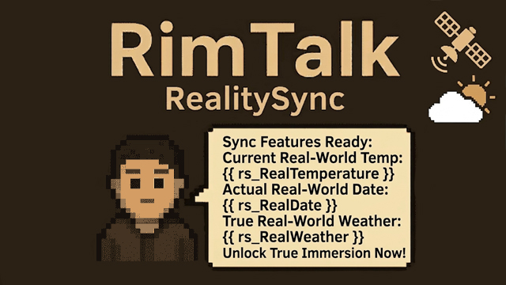

# RimTalk - Reality Sync (现实信息同步)

A RimWorld mod that injects real-world time, date, weather, and save data into [RimTalk](https://github.com/cj-modding/RimTalk). Break the fourth wall and let your colonists sense the reality you live in!

## 🌟 Key Features / 主要功能

- 🕒 **Real-Time Sync / 现实时间同步**: Colonists will know the exact current time and date of your real world.
- 🌤️ **Live Weather API / 实时天气 API**: Supports OpenWeatherMap and HeWeather (QWeather).
- 🍂 **Seasonal Fallback / 节气模拟保底**: Playing offline? The mod will automatically simulate realistic seasonal weather based on the current real-world month.
- 💾 **Save Time Awareness / 存档时间感知**: Colonists can comment on how much time has passed since your last save/play session.

## 🛠️ Available Variables / 可用提示词变量

You can use these variables in your RimTalk prompts:
- `{{ rs_RealTime }}` : Real-world time (HH:mm)
- `{{ rs_RealDate }}` : Real-world date (yyyy-MM-dd)
- `{{ rs_RealWeather }}` : Real-world weather condition
- `{{ rs_RealTemperature }}` : Real-world temperature
- `{{ rs_RealHumidity }}` : Real-world humidity
- `{{ rs_RealLocation }}` : Real-world geographical location
- `{{ rs_LastSaveTime }}` : Real-world time of last save
- `{{ rs_RealSaveDiff }}` : Time elapsed since last save
- `{{ rs_WeatherSource }}` : Weather data source
- `{{ rs_SolarTerm }}` : Current solar term or season

## 🌐 Supported Languages
- English (Built-in Fallback)
- Simplified Chinese (简体中文)
- Traditional Chinese (繁體中文)
- Korean (한국어)

## ⚙️ Requirements
- [Harmony](https://github.com/pardeike/HarmonyRimWorld)
- [RimTalk](https://github.com/cj-modding/RimTalk)

## 📄 License
This project is licensed under the MIT License - see the [LICENSE](LICENSE) file for details.